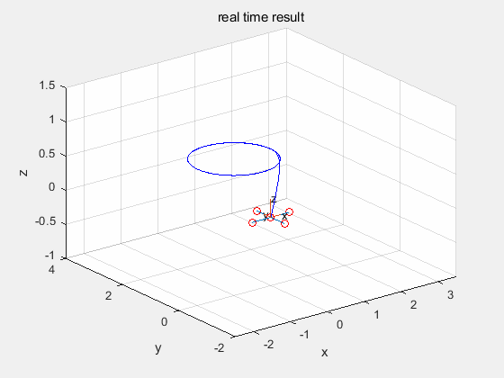

# Usage  

    - BSpline_demo.m trajectory generation demo
    - PD_control_BSpline_demo.m flight demo

# figures

# Reference

Dong, W., Ding, Y., Huang, J., Zhu, X., & Ding, H. (2017). An efficient approach of time-optimal trajectory generation for the fully autonomous navigation of the quadrotor. Journal of Dynamic Systems, Measurement, and Control, 139(6), 061012.
